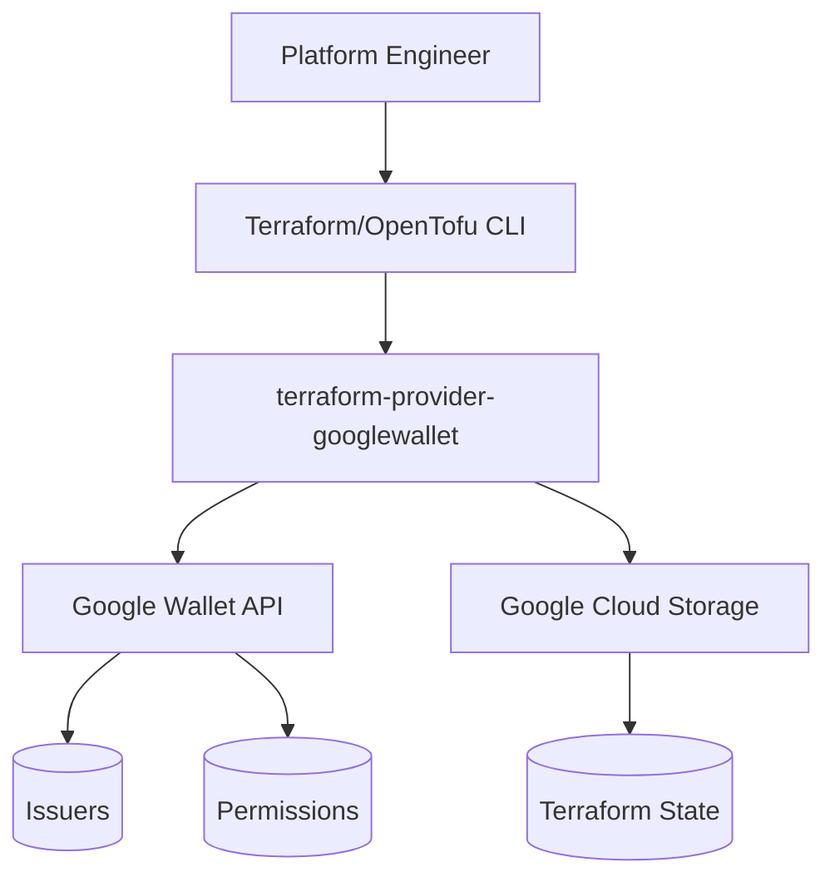
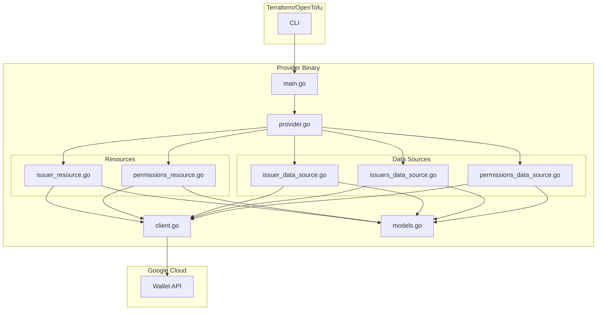
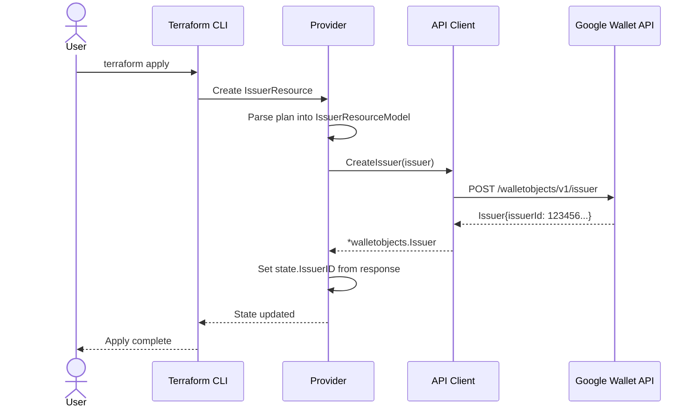

# Solution Design Document

## Validation Checklist

- [x] All required sections are complete
- [x] No [NEEDS CLARIFICATION] markers remain
- [x] All context sources are listed with relevance ratings
- [x] Project commands are discovered from actual project files
- [x] Constraints → Strategy → Design → Implementation path is logical
- [x] Architecture pattern is clearly stated with rationale
- [x] Every component in diagram has directory mapping
- [x] Every interface has specification
- [x] Error handling covers all error types
- [x] Quality requirements are specific and measurable
- [x] Every quality requirement has test coverage
- [x] **All architecture decisions confirmed by user**
- [x] Component names consistent across diagrams
- [x] A developer could implement from this design

---

## Constraints

CON-1 **Language/Framework Requirements**
- Go 1.21+ (for generics, improved error handling)
- HashiCorp Terraform Plugin Framework (not SDK v2)
- `google.golang.org/api/walletobjects/v1` client library
- Target platforms: darwin/linux on amd64/arm64

CON-2 **API Constraints**
- Google Wallet API does not support Issuer deletion
- Permissions update is authoritative (full replacement)
- Rate limit: 20 requests/second per issuer account
- Service account must have "Developer" role in Google Pay Console

CON-3 **Development Standards**
- Follow terraform-provider-appleappstoreconnect patterns exactly
- GoReleaser for builds, GitHub Actions for CI/CD
- golangci-lint for code quality
- Acceptance tests against real API

## Implementation Context

**IMPORTANT**: You MUST read and analyze ALL listed context sources to understand constraints, patterns, and existing architecture.

### Required Context Sources

- ICO-1 [Project Documentation]
```yaml
# Internal documentation and patterns
- doc: docs/patterns/terraform-plugin-framework.md
  relevance: CRITICAL
  why: "Implementation patterns for all resources and data sources"

- doc: docs/interfaces/google-wallet-api.md
  relevance: CRITICAL
  why: "Google Wallet API contract and constraints"

- doc: DESIGN.md
  relevance: HIGH
  why: "Original design decisions and schema definitions"
```

- ICO-2 [Reference Provider]
```yaml
# Reference implementation patterns
- file: /Users/athak/Devel/workspace/truetickets/terraform-provider-appleappstoreconnect/internal/provider/provider.go
  relevance: CRITICAL
  why: "Provider configuration pattern to replicate"

- file: /Users/athak/Devel/workspace/truetickets/terraform-provider-appleappstoreconnect/internal/provider/client.go
  relevance: HIGH
  why: "API client wrapper pattern"

- file: /Users/athak/Devel/workspace/truetickets/terraform-provider-appleappstoreconnect/.goreleaser.yml
  relevance: MEDIUM
  why: "Build and release configuration"
```

- ICO-3 [External Documentation]
```yaml
# External resources
- url: https://developer.hashicorp.com/terraform/plugin/framework
  relevance: CRITICAL
  why: "Terraform Plugin Framework official documentation"

- url: https://developers.google.com/wallet/reference/rest
  relevance: HIGH
  why: "Google Wallet API reference"

- url: https://pkg.go.dev/google.golang.org/api/walletobjects/v1
  relevance: HIGH
  why: "Go client library documentation"
```

### Implementation Boundaries

- **Must Preserve**: N/A (greenfield project)
- **Can Modify**: All files (new project)
- **Must Not Touch**: N/A

### External Interfaces

#### System Context Diagram



#### Interface Specifications

```yaml
# Inbound Interfaces (what calls this system)
inbound:
  - name: "Terraform/OpenTofu CLI"
    type: gRPC
    format: Plugin Protocol v6
    authentication: N/A (local process)
    doc: https://developer.hashicorp.com/terraform/plugin/framework
    data_flow: "Resource CRUD operations, state management"

# Outbound Interfaces (what this system calls)
outbound:
  - name: "Google Wallet API"
    type: HTTPS
    format: REST/JSON
    authentication: OAuth 2.0 (Service Account)
    doc: @docs/interfaces/google-wallet-api.md
    data_flow: "Issuer and Permissions CRUD operations"
    criticality: CRITICAL

# Data Interfaces
data:
  - name: "Terraform State"
    type: JSON
    connection: Terraform Backend
    doc: https://developer.hashicorp.com/terraform/language/state
    data_flow: "Resource state persistence"
```

### Cross-Component Boundaries

Not applicable - single provider binary.

### Project Commands

```bash
# Component: terraform-provider-googlewallet
Location: /Users/athak/Devel/workspace/truetickets/terraform-provider-googlewallet

## Environment Setup
Install Dependencies: go mod download
Environment Variables:
  - GOOGLEWALLET_CREDENTIALS (path or JSON)
  - TF_ACC=1 (for acceptance tests)
Start Development: go build -o terraform-provider-googlewallet

# Testing Commands
Unit Tests: go test ./...
Acceptance Tests: TF_ACC=1 go test ./internal/provider -v -timeout 30m
Test Coverage: go test ./... -coverprofile=coverage.out

# Code Quality Commands
Linting: golangci-lint run
Formatting: go fmt ./...
Vet: go vet ./...

# Build & Compilation
Build Project: go build -o terraform-provider-googlewallet
Install Local: go install

# Task Runner (Taskfile.yml)
Task Build: task build
Task Test: task test
Task Lint: task lint
Task Test Acceptance: task test-acc

# Documentation Generation
Generate Docs: go generate ./...

# Release (via GoReleaser)
Snapshot Build: goreleaser release --snapshot --clean
```

## Solution Strategy

- **Architecture Pattern**: Terraform Plugin Framework provider with layered design (Provider → Resources/DataSources → Client → Google API)
- **Integration Approach**: Provider binary communicates with Terraform via gRPC Plugin Protocol v6, wraps Google Wallet API with idiomatic Go client
- **Justification**: Terraform Plugin Framework is the modern, recommended approach. Following the reference provider ensures battle-tested patterns.
- **Key Decisions**:
  1. Use official `google.golang.org/api/walletobjects/v1` library (not custom HTTP client)
  2. Implement soft delete for Issuers (log warning, remove from state)
  3. Authoritative permissions model (matches API behavior)
  4. Environment variable fallback chain for credentials

## Building Block View

### Components



### Directory Map

**Component**: terraform-provider-googlewallet
```
.
├── main.go                              # NEW: Entry point
├── go.mod                               # NEW: Module definition
├── go.sum                               # NEW: Dependency checksums
├── internal/
│   └── provider/
│       ├── provider.go                  # NEW: Provider configuration
│       ├── client.go                    # NEW: Google Wallet API wrapper
│       ├── models.go                    # NEW: Shared type definitions
│       ├── issuer_resource.go           # NEW: Issuer resource CRUD
│       ├── issuer_resource_test.go      # NEW: Issuer resource tests
│       ├── issuer_data_source.go        # NEW: Issuer data source
│       ├── issuer_data_source_test.go   # NEW: Issuer data source tests
│       ├── issuers_data_source.go       # NEW: Issuers list data source
│       ├── issuers_data_source_test.go  # NEW: Issuers list tests
│       ├── permissions_resource.go      # NEW: Permissions resource
│       ├── permissions_resource_test.go # NEW: Permissions tests
│       ├── permissions_data_source.go   # NEW: Permissions data source
│       └── permissions_data_source_test.go # NEW: Permissions DS tests
├── templates/
│   ├── index.md.tmpl                    # NEW: Provider docs template
│   ├── resources/
│   │   ├── issuer.md.tmpl               # NEW: Issuer resource docs
│   │   └── permissions.md.tmpl          # NEW: Permissions docs
│   └── data-sources/
│       ├── issuer.md.tmpl               # NEW: Issuer DS docs
│       ├── issuers.md.tmpl              # NEW: Issuers list docs
│       └── permissions.md.tmpl          # NEW: Permissions DS docs
├── examples/
│   ├── provider/
│   │   └── provider.tf                  # NEW: Provider example
│   ├── resources/
│   │   ├── googlewallet_issuer/
│   │   │   └── resource.tf              # NEW: Issuer example
│   │   └── googlewallet_permissions/
│   │       └── resource.tf              # NEW: Permissions example
│   └── data-sources/
│       ├── googlewallet_issuer/
│       │   └── data-source.tf           # NEW: Issuer DS example
│       ├── googlewallet_issuers/
│       │   └── data-source.tf           # NEW: Issuers list example
│       └── googlewallet_permissions/
│           └── data-source.tf           # NEW: Permissions DS example
├── docs/                                # GENERATED: tfplugindocs output
├── .github/
│   └── workflows/
│       ├── test.yml                     # NEW: CI workflow
│       └── release.yml                  # NEW: Release workflow
├── .goreleaser.yml                      # NEW: Release configuration
├── .golangci.yml                        # NEW: Linter configuration
├── Taskfile.yml                         # NEW: Task runner
├── GNUmakefile                          # NEW: Make compatibility
└── tools/
    └── tools.go                         # NEW: Tool dependencies
```

### Interface Specifications

#### Interface Documentation References

```yaml
# Reference existing interface documentation
interfaces:
  - name: "Google Wallet API"
    doc: @docs/interfaces/google-wallet-api.md
    relevance: CRITICAL
    sections: [issuer_endpoints, permissions_endpoints, authentication]
    why: "All API operations implemented by the provider"

  - name: "Terraform Plugin Framework Patterns"
    doc: @docs/patterns/terraform-plugin-framework.md
    relevance: CRITICAL
    sections: [provider_implementation, resource_patterns, data_source_patterns]
    why: "Implementation patterns for all components"
```

#### Data Storage Changes

Not applicable - provider does not manage its own storage. State is managed by Terraform backend.

#### Internal API Changes

Not applicable - provider is a new binary with no existing API.

#### Application Data Models

```pseudocode
# Provider Configuration Model
MODEL: GoogleWalletProviderModel
  FIELDS:
    credentials: types.String (Optional, Sensitive)

# Issuer Resource Model
MODEL: IssuerResourceModel
  FIELDS:
    issuer_id: types.String (Computed)
    name: types.String (Required)
    contact_info: types.Object (Required)
    homepage_url: types.String (Optional)

# Contact Info Model (Nested)
MODEL: ContactInfoModel
  FIELDS:
    name: types.String (Required)
    email: types.String (Required)
    phone: types.String (Optional)

# Permissions Resource Model
MODEL: PermissionsResourceModel
  FIELDS:
    issuer_id: types.String (Required)
    permissions: types.List[PermissionModel] (Required)

# Permission Model (Nested)
MODEL: PermissionModel
  FIELDS:
    email_address: types.String (Required)
    role: types.String (Required, OneOf: OWNER|READER|WRITER)

# Issuer Data Source Model
MODEL: IssuerDataSourceModel
  FIELDS:
    issuer_id: types.String (Required)
    name: types.String (Computed)
    contact_info: types.Object (Computed)
    homepage_url: types.String (Computed)

# Issuers List Data Source Model
MODEL: IssuersDataSourceModel
  FIELDS:
    issuers: types.List[IssuerSummaryModel] (Computed)

# Issuer Summary Model
MODEL: IssuerSummaryModel
  FIELDS:
    issuer_id: types.String
    name: types.String
    homepage_url: types.String

# Permissions Data Source Model
MODEL: PermissionsDataSourceModel
  FIELDS:
    issuer_id: types.String (Required)
    permissions: types.List[PermissionModel] (Computed)
```

#### Integration Points

```yaml
# External System Integration
Google_Wallet_API:
  - doc: @docs/interfaces/google-wallet-api.md
  - sections: [issuer_endpoints, permissions_endpoints]
  - integration: "HTTPS REST via google.golang.org/api/walletobjects/v1"
  - critical_data: [issuer_config, permissions_list]
  - authentication: "OAuth 2.0 Service Account"
```

### Implementation Examples

#### Example: Client Initialization with Credential Detection

**Why this example**: Credential handling is critical and supports multiple formats (file path vs JSON content) plus environment variable fallbacks.

```go
// Example: Credential detection and client initialization
func NewClient(ctx context.Context, credentials string) (*walletobjects.Service, error) {
    var opts []option.ClientOption

    // Detect credential format
    if credentials == "" {
        return nil, fmt.Errorf("credentials cannot be empty")
    }

    // Check if credentials is a file path or JSON content
    if _, err := os.Stat(credentials); err == nil {
        // File exists - use as credentials file
        opts = append(opts, option.WithCredentialsFile(credentials))
    } else if json.Valid([]byte(credentials)) {
        // Valid JSON - use as credentials JSON
        opts = append(opts, option.WithCredentialsJSON([]byte(credentials)))
    } else {
        return nil, fmt.Errorf("credentials must be a valid file path or JSON content")
    }

    // Create service with scopes
    opts = append(opts, option.WithScopes(
        "https://www.googleapis.com/auth/wallet_object.issuer",
    ))

    return walletobjects.NewService(ctx, opts...)
}
```

#### Example: Soft Delete Pattern for Issuers

**Why this example**: Shows how to handle API limitation where deletion is not supported.

```go
// Example: Soft delete implementation
func (r *IssuerResource) Delete(ctx context.Context, req resource.DeleteRequest, resp *resource.DeleteResponse) {
    var state IssuerResourceModel

    resp.Diagnostics.Append(req.State.Get(ctx, &state)...)
    if resp.Diagnostics.HasError() {
        return
    }

    // Google Wallet API does not support issuer deletion
    // Log warning - state removal happens automatically
    tflog.Warn(ctx, "Google Wallet API does not support issuer deletion. "+
        "The issuer will be removed from Terraform state but will continue to exist.",
        map[string]interface{}{
            "issuer_id": state.IssuerID.ValueString(),
        })

    // Optionally add a diagnostic warning to the user
    resp.Diagnostics.AddWarning(
        "Issuer Not Deleted from Google Wallet",
        fmt.Sprintf("The issuer %s has been removed from Terraform state but continues to exist in Google Wallet. "+
            "Google Wallet API does not support issuer deletion.", state.IssuerID.ValueString()),
    )

    // Resource is automatically removed from state when Delete returns without error
}
```

#### Example: Authoritative Permissions Update

**Why this example**: Shows the critical pattern where permissions are completely replaced.

```go
// Example: Authoritative permissions update
func (r *PermissionsResource) Update(ctx context.Context, req resource.UpdateRequest, resp *resource.UpdateResponse) {
    var plan PermissionsResourceModel

    resp.Diagnostics.Append(req.Plan.Get(ctx, &plan)...)
    if resp.Diagnostics.HasError() {
        return
    }

    // Build complete permissions list from plan
    var permissions []*walletobjects.Permission
    for _, p := range plan.Permissions.Elements() {
        permObj := p.(types.Object)
        var permModel PermissionModel
        permObj.As(ctx, &permModel, basetypes.ObjectAsOptions{})

        permissions = append(permissions, &walletobjects.Permission{
            EmailAddress: permModel.EmailAddress.ValueString(),
            Role:         permModel.Role.ValueString(),
        })
    }

    // CRITICAL: This replaces ALL existing permissions
    issuerId, _ := strconv.ParseInt(plan.IssuerID.ValueString(), 10, 64)
    _, err := r.client.Permissions.Update(issuerId, &walletobjects.Permissions{
        IssuerId:    plan.IssuerID.ValueString(),
        Permissions: permissions,
    }).Context(ctx).Do()

    if err != nil {
        resp.Diagnostics.AddError("Unable to Update Permissions", err.Error())
        return
    }

    resp.Diagnostics.Append(resp.State.Set(ctx, plan)...)
}
```

## Runtime View

### Primary Flow

#### Primary Flow: Create Issuer Resource

1. User writes HCL configuration defining `googlewallet_issuer`
2. User runs `terraform plan` - provider reads API to compare
3. User runs `terraform apply` - provider calls `issuer.insert`
4. Google assigns `issuer_id` and returns full issuer object
5. Provider stores computed `issuer_id` in Terraform state



### Error Handling

- **Invalid credentials**: `AddAttributeError` on "credentials" path with guidance to set env var
- **Missing required fields**: Terraform validation errors before API call
- **Invalid email format**: `stringvalidator.RegexMatches` validation error
- **Invalid role value**: `stringvalidator.OneOf` validation error
- **API rate limiting**: Return error with suggestion to retry
- **Issuer not found (Read)**: Remove resource from state (drift detection)
- **Issuer not found (other ops)**: Return error to user
- **Permission denied**: Return API error with credential guidance
- **Network failure**: Return error with retry suggestion

### Complex Logic

#### Authoritative Permissions Lifecycle

```
ALGORITHM: Manage Authoritative Permissions
INPUT: desired_permissions (from plan), issuer_id
OUTPUT: updated_permissions (in state)

1. CREATE:
   - Read current permissions from API (may be empty or have defaults)
   - Send complete desired list via permissions.update
   - Store desired list in state

2. READ:
   - Fetch current permissions from API
   - Update state to match API response
   - Plan will show diff if API drifted from state

3. UPDATE:
   - Send complete desired list via permissions.update
   - Any permissions NOT in list are REMOVED
   - Store updated list in state

4. DELETE:
   - Send empty permissions list via permissions.update
   - Resource removed from state
```

## Deployment View

### Single Application Deployment

- **Environment**: Provider binary runs as subprocess of Terraform CLI
- **Configuration**:
  - `GOOGLEWALLET_CREDENTIALS` - Service account credentials
  - `GOOGLE_CREDENTIALS` - Fallback credentials
- **Dependencies**: Google Wallet API must be enabled in GCP project
- **Performance**:
  - Expected: <500ms per API call
  - Rate limit: 20 req/s per issuer account
  - No caching required (Terraform handles state)

### Multi-Component Coordination

Not applicable - single provider binary.

## Cross-Cutting Concepts

### Pattern Documentation

```yaml
# Existing patterns used in this feature
- pattern: @docs/patterns/terraform-plugin-framework.md
  relevance: CRITICAL
  why: "All resource and data source implementations follow these patterns"
```

### Interface Specifications

```yaml
# External interfaces this feature integrates with
- interface: @docs/interfaces/google-wallet-api.md
  relevance: CRITICAL
  why: "All API operations documented here"
```

### System-Wide Patterns

- **Security**: OAuth 2.0 service account authentication, credentials marked as Sensitive
- **Error Handling**: Diagnostic-based errors with attribute paths where applicable
- **Performance**: Direct API calls, no caching (Terraform manages state)
- **Logging**: tflog for debug/info/warn levels with structured context

### Implementation Patterns

#### Code Patterns and Conventions

- Follow Terraform Plugin Framework conventions
- Use `types.String`, `types.Object`, `types.List` for schema types
- Use `*Model` suffix for state/plan models
- Use `New*Resource()` / `New*DataSource()` factory functions
- Implement interface satisfaction checks with `var _ resource.Resource = ...`

#### State Management Patterns

- Plan → State conversion in Create/Update operations
- State → API comparison in Read operations
- `UseStateForUnknown()` plan modifier for computed fields
- `RequiresReplace()` plan modifier for immutable fields (not used in this provider)

#### Error Handling Pattern

```pseudocode
FUNCTION: handle_api_error(err error, operation string)
  IF err == nil:
    RETURN nil

  IF is_not_found_error(err):
    # Resource deleted externally - remove from state
    RETURN "remove_from_state"

  IF is_permission_denied(err):
    ADD_ERROR("Permission Denied",
      "Ensure service account has Developer role in Google Pay Console")

  IF is_rate_limit(err):
    ADD_ERROR("Rate Limited",
      "Google Wallet API rate limit exceeded. Wait and retry.")

  DEFAULT:
    ADD_ERROR(operation + " Failed", err.Error())
```

#### Test Pattern

```pseudocode
TEST_SCENARIO: "Issuer resource lifecycle"
  SETUP:
    - Valid GOOGLEWALLET_CREDENTIALS in environment
    - TF_ACC=1 to enable acceptance tests

  STEP 1 - Create:
    EXECUTE: Apply config with issuer name and contact_info
    VERIFY:
      - issuer_id is set (computed)
      - name matches config
      - contact_info matches config

  STEP 2 - Import:
    EXECUTE: Import by issuer_id
    VERIFY:
      - State matches step 1

  STEP 3 - Update:
    EXECUTE: Apply with changed name
    VERIFY:
      - name updated
      - issuer_id unchanged

  STEP 4 - Destroy:
    EXECUTE: Destroy resource
    VERIFY:
      - Resource removed from state
      - Warning logged about soft delete
```

## Architecture Decisions

- [x] **ADR-1 Use Terraform Plugin Framework (not SDK v2)**
  - Rationale: Modern approach, cleaner API, better type safety, required for new providers
  - Trade-offs: Slightly steeper learning curve
  - User confirmed: Per existing DESIGN.md

- [x] **ADR-2 Use official Google API client library**
  - Rationale: Maintained by Google, handles auth/retry/serialization
  - Trade-offs: Less control over HTTP layer, dependency on Google's release cycle
  - User confirmed: Per existing DESIGN.md

- [x] **ADR-3 Implement soft delete for Issuers**
  - Rationale: API doesn't support deletion, must handle `terraform destroy` gracefully
  - Trade-offs: Users may be confused that issuers persist; clear warning mitigates
  - User confirmed: Per PRD risk analysis

- [x] **ADR-4 Authoritative permissions model**
  - Rationale: Matches API behavior, simpler state management, clear semantics
  - Trade-offs: Accidental permission removal possible; plan diff mitigates
  - User confirmed: Per PRD feature specification

- [x] **ADR-5 Environment variable fallback chain**
  - Rationale: Flexible authentication, follows Google Cloud conventions
  - Trade-offs: Multiple env vars to document
  - User confirmed: Per DESIGN.md

## Quality Requirements

- **Performance**: API operations complete in <2s under normal conditions
- **Usability**: Clear error messages with actionable guidance
- **Security**: Credentials marked Sensitive (not logged or stored in plan)
- **Reliability**: Proper handling of API errors, rate limits, and not-found scenarios
- **Testability**: 80%+ code coverage, acceptance tests for all CRUD operations

## Risks and Technical Debt

### Known Technical Issues

- Google Wallet API library is in "maintenance mode" - critical bugs only
- No pagination in issuers.list (unlikely to be an issue for typical usage)

### Technical Debt

None - greenfield project following established patterns.

### Implementation Gotchas

- `IssuerId` is returned as int64 but stored as string in Terraform state
- Permissions API uses PUT for both create and update
- Empty permissions list is valid (removes all permissions)
- Service account must be added with "Developer" role, not just "Admin"
- New accounts start in "demo mode" with limited pass distribution

## Test Specifications

### Critical Test Scenarios

**Scenario 1: Create Issuer**
```gherkin
Given: Valid credentials configured
And: No existing issuer with same name
When: User applies config with name "Test Issuer" and contact_info
Then: Issuer is created in Google Wallet
And: issuer_id is computed and stored in state
And: All attributes match configuration
```

**Scenario 2: Update Issuer**
```gherkin
Given: Existing issuer in state
When: User changes name to "Updated Issuer"
Then: Plan shows name change
And: Apply updates issuer via patch
And: issuer_id remains unchanged
```

**Scenario 3: Soft Delete Issuer**
```gherkin
Given: Existing issuer in state
When: User runs terraform destroy
Then: Warning logged about soft delete
And: Resource removed from state
And: Issuer still exists in Google Wallet
```

**Scenario 4: Authoritative Permissions**
```gherkin
Given: Issuer with existing permissions [A: OWNER, B: READER]
When: User applies config with permissions [A: OWNER, C: WRITER]
Then: Plan shows B removed, C added
And: Apply replaces all permissions
And: Final permissions are [A: OWNER, C: WRITER]
```

**Scenario 5: Import Existing Issuer**
```gherkin
Given: Existing issuer "123456" in Google Wallet
When: User runs terraform import googlewallet_issuer.main 123456
Then: Issuer configuration is read from API
And: State is populated with all attributes
And: Subsequent plan shows no changes
```

**Scenario 6: Invalid Credentials**
```gherkin
Given: Invalid or missing credentials
When: User runs terraform plan
Then: Error message indicates missing credentials
And: Suggests setting GOOGLEWALLET_CREDENTIALS
```

### Test Coverage Requirements

- **Business Logic**: CRUD operations, soft delete, authoritative permissions
- **Validation**: Email format, role enum, required fields
- **Integration Points**: Google Wallet API calls, error handling
- **Edge Cases**: Empty permissions, not-found handling, rate limiting
- **Security**: Credentials not logged, marked as sensitive

---

## Glossary

### Domain Terms

| Term | Definition | Context |
|------|------------|---------|
| Issuer | A Google Wallet account that can issue digital passes | The primary resource managed by this provider |
| Permission | Access grant for a user/service account to an Issuer | Managed via googlewallet_permissions resource |
| Smart Tap | NFC-based pass interaction technology | Optional feature requiring Google partnership |

### Technical Terms

| Term | Definition | Context |
|------|------------|---------|
| Authoritative Resource | Resource that defines complete state (not incremental) | googlewallet_permissions replaces all permissions |
| Soft Delete | Remove from state without deleting in backend | Used for Issuers since API doesn't support deletion |
| Plan Modifier | Terraform feature to customize attribute planning | UseStateForUnknown for computed issuer_id |

### API/Interface Terms

| Term | Definition | Context |
|------|------------|---------|
| issuer.insert | Google Wallet API endpoint to create Issuer | POST /walletobjects/v1/issuer |
| issuer.patch | Google Wallet API endpoint to update Issuer | PATCH /walletobjects/v1/issuer/{id} |
| permissions.update | Google Wallet API to replace all permissions | PUT /walletobjects/v1/permissions/{id} |
